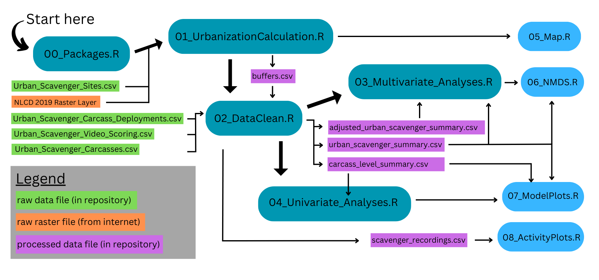

# Urbanization alters sandy beach scavenging assemblages and dogs suppress ecosystem function

FD Gerraty, A Gobei-Bacaylan, K Diel. (2024) Urbanization alters sandy beach scavenging asssemblages and dogs suppress ecosystem function. *Ecosphere*

We examined the influence of anthropogenic disturbances on vertebrate scavenging assemblages and scavenging ecosystem functions on California beaches. Here, we provide an outline of our analyses and provide a description of the scripts and datasets associated with this repository.

------------------------------------------------------------------------

There are five primary R scripts (turquoise in outline) required to run all console and data preparation, data cleaning, and analysis steps:

-   **00_Packages.R** loads every package that is needed in following scripts. After running this script, all following scripts can be run independently.

-   **01_UrbanizationCalculation.R** calculates the extent of urbanization and agricultural cultivation within buffers of three radii (1km, 3km, 5km) of each site.

-   **02_DataClean.R** cleans and summarizes raw data files. This script also generates the components that form Figure S1.

-   **03_Multivariate_Analyses.R** conducts all permutational analysis of variance (PERMANOVA) and multivariate generalized linear modelling (MvGLM) to investigate the best predictors of scavenging assemblages. This script also generates tables S2-S11 in the manuscript.

-   **04_Univariate_Analyses.R** conducts all analyses related to the effects of anthropogenic disturbances on metrics of carrion scavenging ecosystem functions. This script also generates tables S12-S15 in the manuscript.

In addition, there are four scripts (light blue in outline) dedicated to generating plots for primary and supplemental figures:

-   **05_Map.R** generates the map of urbanization extent and study sites (Fig. 1)

-   **06_NMDS_Plot.R** generates a NMDS plot showing the best-fitting MvGLM model in ordination space (Fig. 4)

-   **07_ModelPlots.R** generates all plots of urbanization effects on scavenger species and ecosystem functions (Figs. 5, 6, S2, S3, S4)

-   **08_ActivityPlots.R** generates plots depicting temporal dynamics of scavenging activity (Figs. 3, 7, S5) and the scavenger summary table (Table S1).

------------------------------------------------------------------------

### Directory Information

#### Folder "[data](https://github.com/fgerraty/Urban_Scavengers/tree/main/data)" houses the following folders and files

Folder **"[raw](https://github.com/fgerraty/Urban_Scavengers/tree/main/data/raw)"** containing all raw data files

-   folder **nlcd_2019_land_cover_l48_20210604** containing [NLCD 2019](https://doi.org/10.5066/P9KZCM54) Land Cover Database files (.ige, .img, .rde, .rrd, .xml). [Here's a cheatsheet](https://www.mrlc.gov/data/legends/national-land-cover-database-class-legend-and-description) to the land cover code descriptions. The files can be downloaded directly from the file download portal at [this link](https://www.sciencebase.gov/catalog/item/604a4fb1d34eb120311b0039), under the title "nlcd_2019_land_cover_l48_20210604". NOTE: Due to large file size, this must be downloaded independently from the website above and placed in a folder with the exact name above ("nlcd_2019_land_cover_l48_20210604") for scripts *01_UrbanizationCalculation.R* and *05_Map.R* to run.

-   **Urban_Scavenger_Carcass_Deployments.csv** - outlines raw data collected for each carcass deployment

    Columns

    -   Site Name

    -   Deployment Number - reference number for each 48-hour window in which carcasses were deployed

    -   Deploy Date - date of carcass placement

    -   Deploy Time - time of carcass placement

    -   Cam \# - unique camera trap ID

    -   SD \# - unique SD card ID

    -   Carcass ID - unique fish carcass ID

    -   No Scavenge? - boolean (TRUE/FALSE) for whether carcass exhibited any evidence of vertebrate scavenging. TRUE indicates no scavenging activity occurred, FALSE indicates either partial scavenging or carcass removal.

    -   Partial Scavenge? - boolean (TRUE/FALSE) for whether carcass evidence of vertebrate scavenging *but not* carcass removal. TRUE indicates vertebrate scavenging occurred, but that the carcass was not removed, FALSE indicates either no scavenging or carcass removal.

    -   No/Partial Scavenge Retrieve Date - date of carcass removal by researchers if not scavenged or if partially scavenged.

    -   No/Partial Scavenge Retrieve Time - time of carcass removal by researchers if not scavenged or if partially scavenged.

    -   Camera Failure - boolean (TRUE/FALSE) for whether camera failure occurred. Camera failures removed from dataset in cleaning steps.

-   **Urban_Scavenger_Carcasses.csv** - outlines raw data for each fish carcass

    Columns

    -   Carcass ID - unique fish carcass ID

    -   Mass (kg) - pre-deployment fish mass

    -   Post-Deployment Mass (kg) - fish mass after deployment (0 indicates carcass removal, and post-deployment mass matching pre-deployment mass indicated no scavenging activity)

    -   kg consumed - mass (kg) of fish scavenged (i.e. pre-deployment minus post-deployment mass)

    -   Proportion Consumed - proportion of pre-deployment mass consumed (0-1)

-   **Urban_Scavenger_Sites.csv** - site locations

    Columns

    -   Name - site name
    -   Latitude
    -   Longitude

-   **Urban_Scavenger_Video_Scoring.csv** - dataset of all videos recorded throughout project

    Columns

    -   Deployment \# - reference number for each 48-hour window in which carcasses were deployed

    -   SD \# - unique SD card ID

    -   Date - date of video capture

    -   Time - time of video capture

    -   Video \# - video file name (unique within any given Deployment#/SD# combination)

    -   Carcass \# - unique fish carcass ID

    -   Partial Scavenge? - boolean (TRUE/FALSE) for whether vertebrate scavengers engaged in scavenging activity *but not* carcass removal within video. TRUE indicates vertebrate scavenging occurred, but that the carcass was not removed, FALSE indicates either no scavenging or carcass removal.

    -   Full Scavenge (Carcass Removal)? - boolean (TRUE/FALSE) for whether vertebrate scavengers removed carcass within video. TRUE indicates vertebrate scavengers removed carcass, FALSE indicates either no scavenging or partial scavenging.

    -   Camera Trappers? - boolean (TRUE/FALSE) for whether video captured project-associated researchers (typically while placing camera/carcass).

    -   Deer Mouse - \# individual (MaxN) deer mice (*Peromyscus spp.*) documented scavenging in video.

    -   Common Raven - \# individual (MaxN) common ravens (*Corvus corax*) documented scavenging in video.

    -   American Crow - \# individual (MaxN) American crows (*Corvus brachyrhynchos*) documented scavenging in video.

    -   Rat - \# individual (MaxN) rats (*Rattus spp.*) documented scavenging in video.

    -   Coyote - \# individual (MaxN) coyotes (*Canis latrans*) documented scavenging in video.

    -   Domestic Dog - \# individual (MaxN) domestic dogs (*Canis lupus familiaris*) documented scavenging in video.

    -   Raccoon - \# individual (MaxN) raccoons (*Procyon lotor*) documented scavenging in video.

    -   Gray Fox - \# individual (MaxN) gray foxes (*Urocyon cinereoargenteus*) documented scavenging in video.

    -   Striped Skunk - \# individual (MaxN) striped skunks (*Mephitis mephitis*) documented scavenging in video.

    -   Virginia Opossum - \# individual (MaxN) Virginia opossums (*Didelphis virginiana*) documented scavenging in video.

    -   Western Gull - \# individual (MaxN) western gulls (*Larus occidentalis*) documented scavenging in video.

    -   Domestic Cat - \# individual (MaxN) domestic cats (*Felis catus*) documented scavenging in video.

    -   Human Visitors - boolean (TRUE/FALSE) for whether video captured human presence (but not project-associated researchers).

    -   Domestic Dog Visitors - boolean (TRUE/FALSE) for whether video captured domestic dog presence (but not domestic dog scavenging).

    -   Camera Failure? - boolean (TRUE/FALSE) for whether camera failure occurred. Camera failures removed from dataset in cleaning steps.

Folder **"[processed](https://github.com/fgerraty/Urban_Scavengers/tree/main/data/processed)"** containing processed data files

-   **buffers.csv** - dataset containing the values for land cover derived in script 01_UrbanizationCalculation.R

    Columns

    -   Site Name, Latitude, Longitude - same as **Urban_Scavenger_Sites.csv** above.

    -   percent_developed_1km, percent_developed_3km, percent_developed_5km - proportion of land cover (i.e. excluding open water) within specified radius (1km, 3km, or 5km) under our "developed land" class (i.e. NLCD classes "Developed Open Space", "Low Intensity Development", "Medium-Intensity Development", and "High-Intensity Development").

    -   percent_agricultural_1km, percent_agricultural_3km, percent_agricultural_5km - proportion of land cover (i.e. excluding open water) within specified radius (1km, 3km, or 5km) under our "agricultural land" class (i.e. NLCD classes "Pasture/Hay", "Cultivated Crops").

-   **urban_scavengers_summary.csv** - primary community-level dataset containing all site-level data including predictors and scavenging assemblages (effort-adjusted MaxN values).

    Columns

    -   Site, Latitude, Longitude, percent_developed_1km, percent_developed_3km, percent_developed_5km, percent_agricultural_1km, percent_agricultural_3km, percent_agricultural_5km - same as **buffers.csv** above

    -   human_visitors_per_day - number of videos documenting humans per 24 hours of camera deployment at each site.

    -   domestic_dog_visitors_per_day - number of videos documenting domestic dogs per 24 hours of camera deployment at each site.

    -   n_fish_deployed - number of fish deployed at site

    -   n_fish_removed - number of fish removed by scavengers at site

    -   n_partially_scavenged - number of fish partially scavenged at site

    -   kg_deployed - mass (kg) of fish deployed at site

    -   kg_consumed - mass (kg) of fish removed by scavengers at site

    -   proportion removed - proportion of fish mass (0-1) removed by removed by scavengers at site

    -   american_crow, domestic_dog, coyote, deer_mouse, common_raven, gray_fox, domestic_cat, rat, striped_skunk, racoon, western_gull, virginia_opossum - effort-adjusted MaxN value for each scavenger species documented at each site.

-   **adjusted_urban_scavengers_summary.csv** - secondary community-level dataset containing all site-level data including predictors and scavenging assemblages (alternative MaxN values). Columns the same as **urban_scavengers_summary.csv**. See manuscript for a description of effort-adjusted vs. alternative MaxN relative abundance measures.

-   **carcass_level_summary.csv** - primary carcass-level dataset containing all carcass-level data including carcass ID, metrics of scavenging ecosystem functions, and site-level predictors.

    Columns

    -   site_name - site name

    -   carcass_id - unique carcass ID \#

    -   no_scavenge - boolean (TRUE/FALSE) for whether any scavenging occurred. TRUE indicates vertebrate scavenging occurred (partial scavenging or carcass removal), FALSE indicates no vertebrate scavenging took place.

    -   partial_scavenge - boolean (TRUE/FALSE) for whether vertebrate scavengers engaged in partial scavenging activity *but not* carcass removal. TRUE indicates partial vertebrate scavenging occurred, but that the carcass was not removed, FALSE indicates either no scavenging or carcass removal.

    -   mass_kg, kg_consumed, proportion_consumed - same as **Urban_Scavenger_Carcasses.csv**

    -   deployment_date_time - date and time of carcass deployment

    -   deployment_type_AM_PM - type (daytime vs. nighttime) of carcass deployment. Daytime deployments placed within 2 hours of sunrise, nighttime deployments placed within 2 hours of sunset.

    -   first_scavenger_date_time - date and time of first vertebrate scavenging event on carcass. NA if no scavenging occurred.

    -   full_scavenge_date_time - date and time of carcass removal by scavengers. NA if no scavenging or only partial scavenging occurred.

    -   hours_to_first_scavenging_event - elapsed time from deployment to first vertebrate scavenging event. NA if no scavenging occurred.

    -   hours_to_full_scavenge - elapsed time from deployment to carcass removal by scavengers. NA if no scavenging or only partial scavenging occurred.

    -   percent_developed_1km - same as **buffers.csv**

-   **scavenger_recordings.csv -** all columns the same as the **Urban_Scavenger_Video_Scoring.csv**, except column date_time which includes the date and time together to be used as a POSIXct list using the *lubridate* package.

#### Folder "[output](https://github.com/fgerraty/Urban_Scavengers/tree/main/output)" houses the following folders and files

-   Folder [**extra_figures**](https://github.com/fgerraty/Urban_Scavengers/tree/main/output/extra_figures) containing supporting figures not included in manuscript main text or supplemental information

    -   base_map.pdf, locator_map.pdf- outputs from **05_Map.R** script, combined in Illustrator to make final map (Fig. 1) for publication.

    -   scavenge_probability_plot.pdf, total_scavenge_probability_plot.pdf, hours_until_first_scavenge_plot.pdf, hours_until_full_scavenge_plot.pdf - outputs from **07_ModelPlots.R** script, combined in illustrator to make Fig. S3 for publication.

    -   detection_pie.pdf, removal_pie.pdf, waffle.pdf - outputs from **08_ActivityPlots.R** script, combined in illustrator to make Fig. 3 for publication.

    -   urbanization_select_scavengers_glm.pdf - output from **07_ModelPlots.R** script, modified in illustrator to make Fig. 5 for publication.

    -   repository_outline.png - outline of repository (figure above in **README.md** file)

    -   dog_urbanization_glmm.pdf, urbanization_period_glmm1.pdf, urbanization_period_glmm2.pdf - output from **07_ModelPlots.R** script, modified in illustrator to make Fig. 6 for publication.

    -   buffers_plot.pdf, buffers_plot2.pdf - output from **02_DataClean.R** combined in illustrator to make Fig. S1 for publication.

-   Folder [**main_figures**](https://github.com/fgerraty/Urban_Scavengers/tree/main/output/main_figures) containing figures included in the main text of the manuscript. Minor edits have been made to some figures using Illustrator.

    -   Fig. 1 - map.pdf
    -   Fig. 2 - scavenger_panel.pdf
    -   Fig. 3 - scavenger_breakdown.pdf
    -   Fig. 4 - NMDS_plot.pdf
    -   Fig. 5 - urbanization_select_scavengers_glm.png
    -   Fig. 6 - carrion_processing.png
    -   Fig. 7 - activity_plot.pdf

-   Folder [**supp_figures**](https://github.com/fgerraty/Urban_Scavengers/tree/main/output/supp_figures) containing tables and figures included in the supplemental information of the manuscript.

    -   Fig. S1 - buffers.png
    -   Fig. S2 - urbanization_all_scavengers_glm.pdf
    -   Fig. S3 - ecosystem_function.pdf
    -   Fig. S4 - dog_period_glmm.pdf
    -   Fig. S5 - activity_plot_all_scavengers.pdf
    -   Table S1 - scavenger_species_summary_table.png
    -   Table S2 - PERMANOVA_top_models_table.pdf
    -   Table S3 - PERMANOVA_top_predictors_table.pdf
    -   Table S4 - PERMANOVA_all_models_table.pdf
    -   Table S5 - MvGLM_summary_table.pdf
    -   Table S6 - MvGLM_all_models_table.pdf
    -   Table S7 - adjusted_PERMANOVA_top_models_table.pdf
    -   Table S8 - adjusted_PERMANOVA_top_predictors_table.pdf
    -   Table S9 - adjusted_PERMANOVA_all_models_table.pdf
    -   Table S10 - adjusted_MvGLM_summary_table.pdf
    -   Table S11 - adjusted_MvGLM_all_models_table.pdf
    -   Table S12 - scavenging_probability_table.pdf
    -   Table S13 - removal_probability_table.pdf
    -   Table S14 - time_to_first_scavenging_table.pdf
    -   Table S15 - time_to_carcass_removal_table.pdf

**Urban_Scavengers.Rproj** - R project for running scripts and directory in RStudio.
